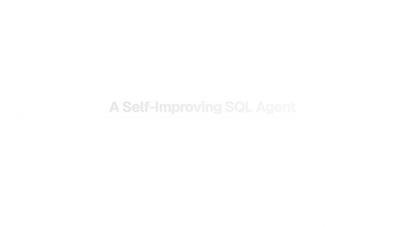
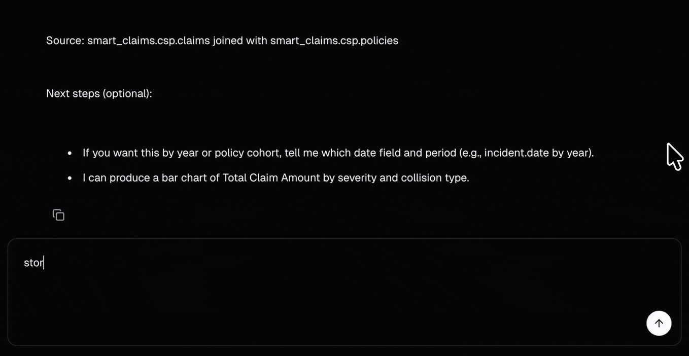
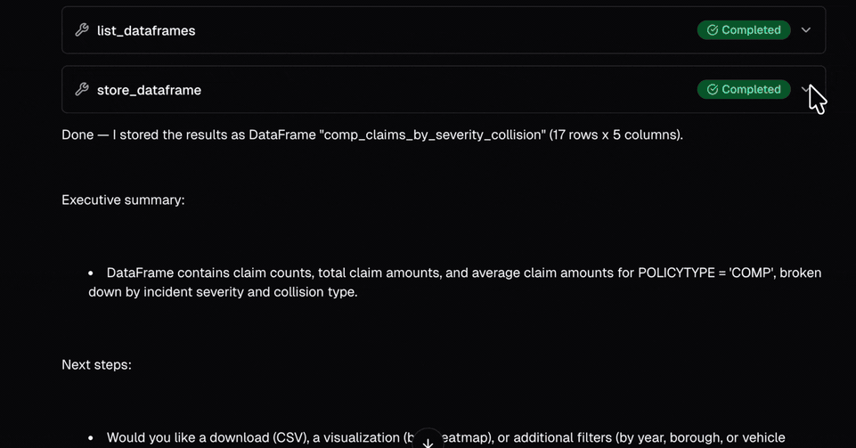
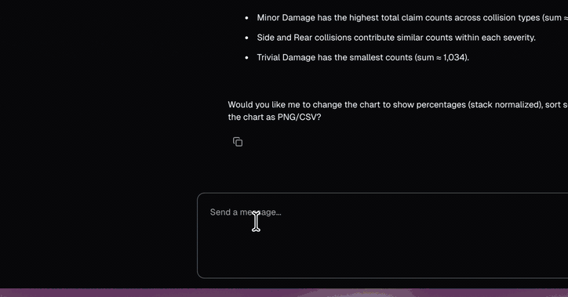
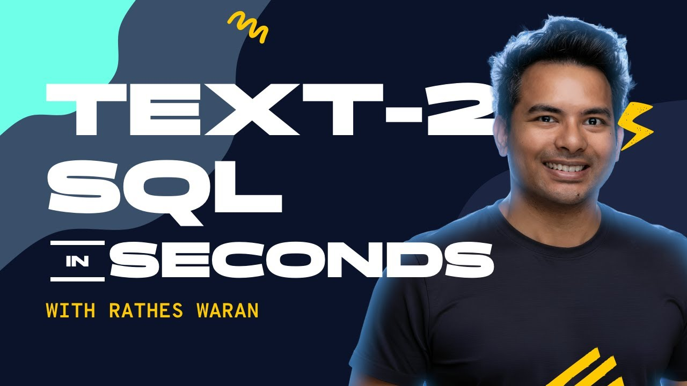

  

  # Rathes Waran

  **Building AI agents that turn messy data into business answers.**

  Founder of [Resonance Analytics](https://www.resonance-analytics.com) — production AI on Databricks.

  [Website](https://www.resonance-analytics.com) · [LinkedIn](https://www.linkedin.com/in/rathes-waran/) · [YouTube](https://www.youtube.com/@resonanceanalytics)

---

## About

I design and ship production AI systems for data teams: SQL agents, RAG pipelines, and the orchestration layer that makes them safe enough for real users. Current focus is Databricks Mosaic AI, LangGraph, and the human-in-the-loop patterns that turn brittle demos into reliable products.

---

## Featured work

### Multi-Agent Framework — a SQL agent that learns from its mistakes

Production SQL agent on Databricks Mosaic AI with composable middleware, human-in-the-loop clarification on high-risk queries, and a feedback loop that rewrites its own system prompts. Built for messy insurance claims data; usable by analysts who don't write SQL.

`LangGraph` · `MLflow Model Serving` · `Databricks` · `PostgreSQL` · `React`

[Read the case study →](https://www.resonance-analytics.com/projects/multi-agent-framework)

---

### Deep Agents in Production

A working insurance-claims agent built on the deep agents pattern — long-horizon, tool-using LLM workflows. This is harness engineering: designing the scaffolding around the model that turns a one-shot LLM call into a reliable runtime. The agent answers natural-language questions about claims data, caches semantic context across turns, persists intermediate dataframes to the workspace, generates visualisations, and runs Databricks notebooks as tools.

---

### Build an AI Data Assistant in Databricks — tutorial

Step-by-step walkthrough of setting up Databricks Genie as a natural-language data assistant — space configuration, instructions, sample queries, and the gotchas that don't make it into the docs.

[Watch on YouTube →](https://www.youtube.com/watch?v=lK4lHmtAc6Q)

---

## Stack

`Databricks` · `LangGraph` · `MLflow` · `Python` · `TypeScript` · `Next.js` · `React` · `PostgreSQL` · `Azure` · `Vercel`

---

## Get in touch

For consulting or collaboration: **[resonance-analytics.com](https://www.resonance-analytics.com)** · **[LinkedIn](https://www.linkedin.com/in/rathes-waran/)**

<!-- Last updated: 2026-04-11 -->

<!-- Re-published via Contents API at 2026-04-11T11:05:57Z -->
